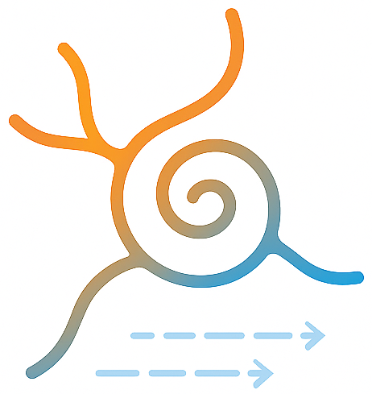

## 🚧 Under Development

This project is still in an **alpha stage**. Implementation is not complete. Expect rapid changes and incomplete features.

#  Flow-Registration MCP

Model Context Protocol (MCP) server for Flow-Registration - variational optical-flow motion correction for 2-photon (2P) microscopy videos and volumetric 3D scans.

This MCP server provides programmatic access to Flow-Registration functionality through the Model Context Protocol, enabling AI assistants and other MCP clients to perform motion correction on microscopy data.

**Related projects**
- Original Flow-Registration repo: https://github.com/FlowRegSuite/flow_registration
- Python implementation: https://github.com/FlowRegSuite/pyflowreg
- ImageJ/Fiji plugin: https://github.com/FlowRegSuite/flow_registration_IJ
- Napari plugin: https://github.com/FlowRegSuite/napari-flowreg


## Requirements

- Python 3.10 or higher
- FastMCP framework

## Installation

Clone the repository and install dependencies:

```bash
git clone https://github.com/FlowRegSuite/flowreg-mcp.git
cd flowreg-mcp
pip install -r requirements.txt
```

## Setup as MCP Server

To use this as an MCP server with Claude Desktop or other MCP clients:

1. Install the MCP server:
```bash
pip install -e .
```

2. Configure your MCP client (e.g., Claude Desktop) to connect to the server:
```json
{
  "mcpServers": {
    "flowreg": {
      "command": "python",
      "args": ["-m", "flowreg_mcp"],
      "cwd": "/path/to/flowreg-mcp"
    }
  }
}
```

## Getting started

Once configured, the MCP server exposes Flow-Registration functionality through standard MCP tools and resources. The server provides motion correction capabilities for microscopy data through a programmatic interface.


## Dataset

The dataset which we used for our evaluations is available as [2-Photon Movies with Motion Artifacts](https://drive.google.com/drive/folders/1fPdzQo5SiA-62k4eHF0ZaKJDt1vmTVed?usp=sharing).

## Citation

Details on the original method and video results can be found [here](https://www.snnu.uni-saarland.de/flow-registration/).

If you use parts of this code or the plugin for your work, please cite

> “Pyflowreg,” (in preparation), 2025.


and for Flow-Registration

> P. Flotho, S. Nomura, B. Kuhn and D. J. Strauss, “Software for Non-Parametric Image Registration of 2-Photon Imaging Data,” J Biophotonics, 2022. [doi:https://doi.org/10.1002/jbio.202100330](https://doi.org/10.1002/jbio.202100330)

BibTeX entry
```
@article{flotea2022a,
    author = {Flotho, P. and Nomura, S. and Kuhn, B. and Strauss, D. J.},
    title = {Software for Non-Parametric Image Registration of 2-Photon Imaging Data},
    year = {2022},
  journal = {J Biophotonics},
  doi = {https://doi.org/10.1002/jbio.202100330}
}
```

